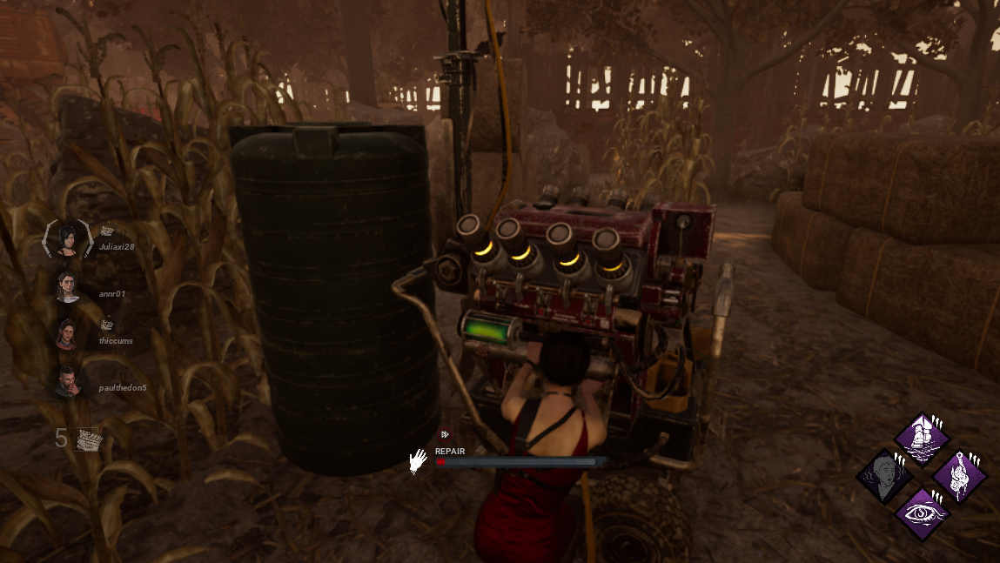
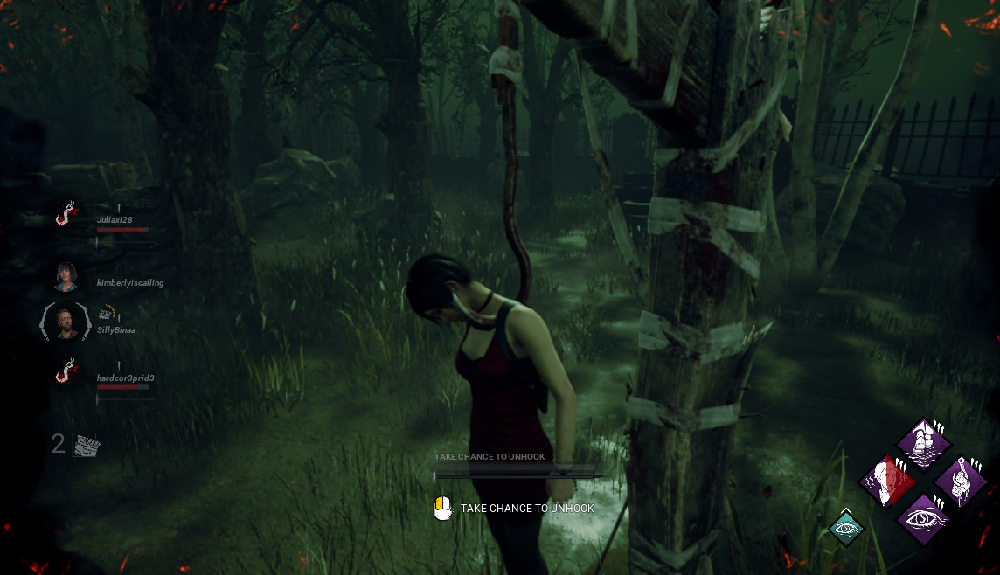
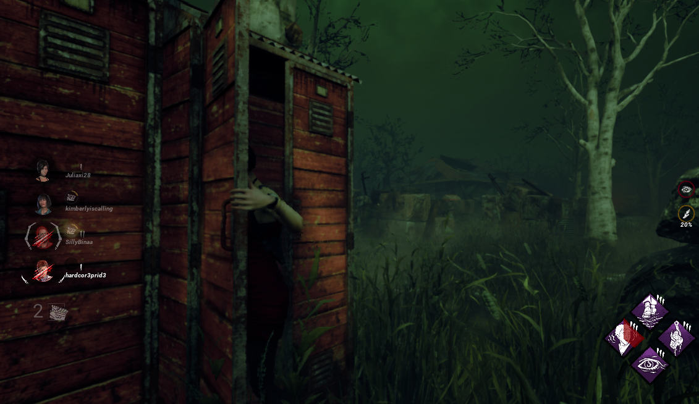
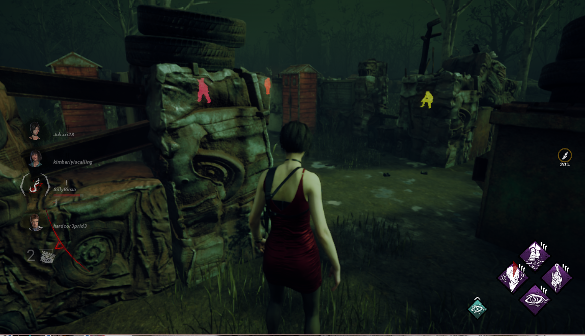
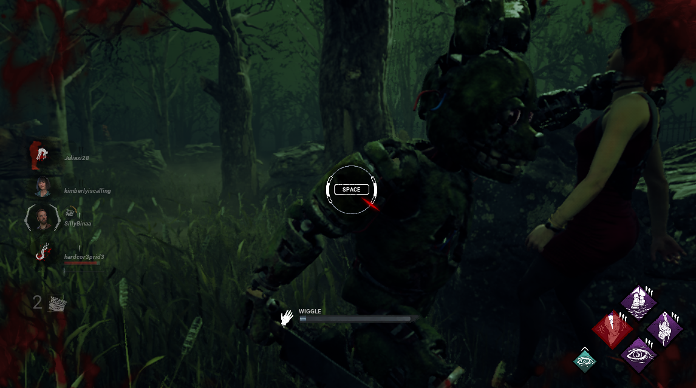

# Dead By Daylight: What Works and What Doesn’t
## Overview
When analyzing the structure and mechanics of a game, turning to incredibly popular multiplayer ones can give extra insight due to the sheer amount of feedback from users. A game like Dead by Daylight, the survival horror phenomena published by Behaviour Interactive, is one such case. According to activeplayer.io , there are over 44,000 active players as of writing this text, and 500 000 - 700 000 different players on a daily basis. 

With these numbers and a dedicated fanbase, there is no shortage of appreciation and criticism for the game, some of said criticism coming from their most dedicated players. I, myself, was one of these players. Although I’ve admittedly not touched the game for a while (for some of the criticisms that I will be presenting later) there was a time where I spent a significant amount of time with the game and, in doing so, I became familiar with the allowances and limitations of the game’s mechanics. 
## Gameplay
Before I begin, I will explain the basic concept of Dead By Daylight. The game is a team-based survival horror. The player can choose to play as a survivor or a killer. As a survivor, the player is grouped with other survivors. Together, 4 survivors must activate a minimum of 5 generators without getting caught in order to open the exit doors, allowing the survivors to escape. To evade the killer, the survivors must hide, run and strategically use the items around them. If caught, the survivors are put on ‘hook’, taking damage and dying if not saved by one of their teammates. After 3 times being ‘hooked’ by the killer, it is an official Game Over for that player, and the remaining survivors must escape without them. At least 3 survivors must escape for their team to win against the killer.

*Fixing a generator. Teammates are displayed on the left, and active abilities are displayed on the bottom right.*

*being "hooked"*
## What Works
So, what does the game do right that made it such a staple within the survival horror genre? From my aforementioned description, it is clear that the game is very simple in concept, and this is one of its strengths. It is very easy to learn, with only a few mechanics that stay the same no matter the survivor’s level. Although the player can get a few different buffs depending on their character, the main tools stay the same: run, hide, use the flashlight to stun a killer and utilise one other item to heal or speed up the ‘fixing’ of the generators. Once these controls are understood, there is little more to learn in the game, and it is up to the player to master the few tools they have. In fact, most of the survivor’s success depends not on their ability to ‘level up’ and even use the buffs and items they’re given, but rather their ability to outrun killers by learning their blindspots, cooperating with teammates to create distractions and memorizing hiding/blind spots on the maps. This mix of straightforward mechanics + actual success being dependent on individual skill makes for a satisfying yet challenging cooperative experience. 

*Entering a hiding spot.*

*As a survivor, I aquired the ability to see the outlines of the killer (in red) and the other players (in yellow + orange). Although this gives me a slight advtange, I am still heavily reliant on hiding and being aware of audio queues.*
## What Doesn’t
However, it is also this simplicity that becomes one of the game’s weaknesses. As mainly a survivor player, I feel as if going up against different killers should be exciting and present new challenges. After all, each killer has unique abilities and these changes shouldn’t only affect the gameplay of the killer but also of the players going against them. Unfortunately, the game hardly changes for the survivors, and this opportunity to introduce variation, especially for long-time players, is missed. Moreover, the unique abilities of some of the killers are overpowered, and the game often fails to offer survivors new solutions to combat these abilities. This not only makes an already difficult game more difficult, but is a missed opportunity at more variation in a round. In fact, the added difficulty wouldn’t be necessarily unwelcome if it presented unique challenges instead of amplifying the difficulty of the old ones. 
The unbalanced dynamic between killers + survivors is a well-known one within the community, and this power imbalance has forced the community to follow a set of unwritten rules in order to make the game playable. For example, camping hooked survivors, ‘tunneling’ (meaning chasing specific survivors until they are downed for a long period of time) and simply ‘downing’ survivors without a method to heal instead of hooking them are all frowned-upon strategies. However, these unwritten rules (which are often also grounds for many an argument) would not have to exist if the aforementioned power imbalance was fixed. These fixes could be as simple as giving the player ways to counter certain attacks, or offer a stun option that is slightly more effective than the flashlight. Another could be an option that requires more than one player, like some sort of defense that can be triggered when multiple survivors join together, to encourage more team-building.

*once caught, the survivor can choose to attempt to "wiggle" free, or accept their fate.*
## In Conclusion…
While Dead By Daylight still remains iconic in the sphere of online multiplayer horror games, it is very much not without its flaws. While the simple concept is appealing to a  wide variety of players, the failure on the part of the development team to balance the power dynamic between survivors and killers has been the main cause of frustration within the fanbase. Moreover, the game itself could benefit from small changes that would add new challenges for players to keep gameplay from getting too repetitive.
