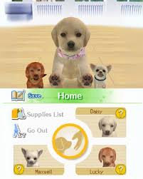
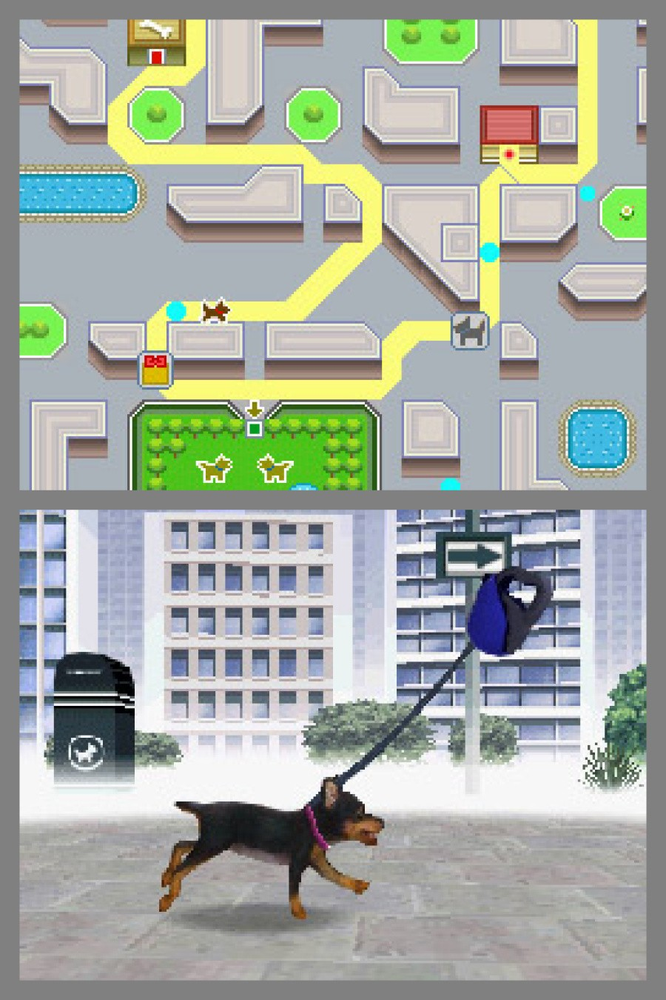
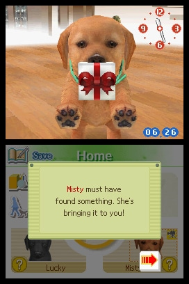
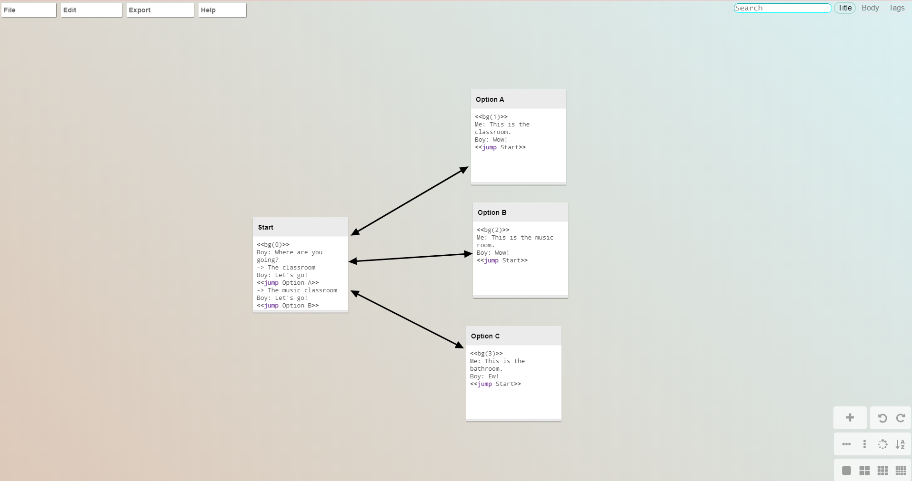
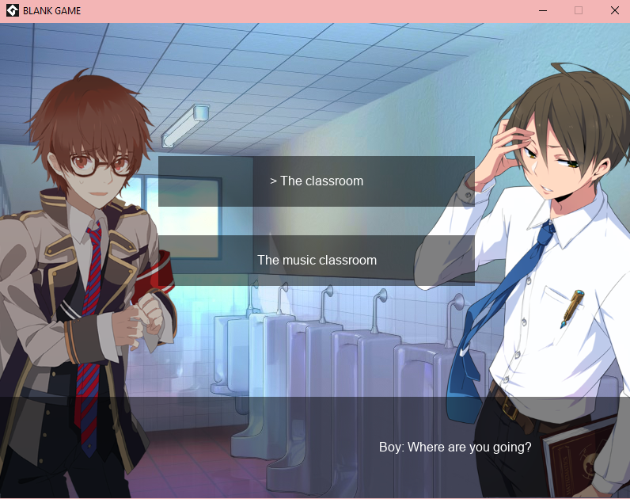
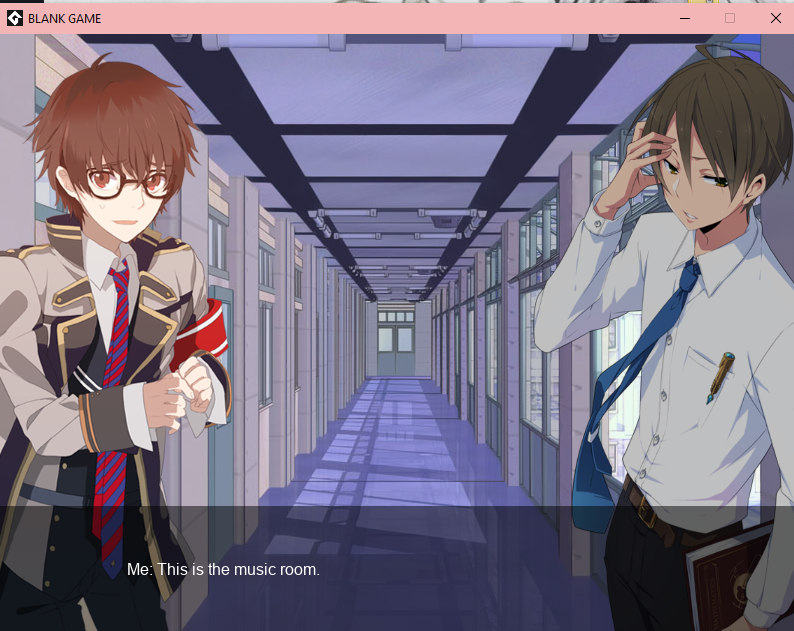

# Design Journal 01
## Intro
As my first project in this class and my submission for ‘Make a Thing’ I decided to do
a very small-scale and simple project, consisting of a simple ‘reach the goal’ platformer with
hand-drawn sprites and an animated character. The game consists of three levels and an
‘ending screen’, and allows the player to jump on platforms while avoiding the spikes and
falling, both of which cause the game to restart. I used Game Maker to make the simple
game, and Procreate to create the images.
## Why GameMaker?
So then, why did I go about making something so simple in an engine that is unfamiliar to
me? Well, originally I was planning on coding something in JavaScript using the P5 library, a
method that was introduced to me during my first year in Computation Arts, and that I have
since grown very familiar with. However, after some debating, I finally decided I wanted to
use this opportunity to try using a software I was unfamiliar with. I knew the final outcome
would be less elaborate, but being able to experiment in a software I had been meaning to try
felt more compelling.
## Looking Back...
However, saying I had no experience in game Maker would be a lie. In fact, Game
Maker was the first software I ever used to
try to code something many years ago,
following a YouTube tutorial series by Sara
Spaulding in order to familiarize myself.
However, I never finished the game due to
my inexperience. So, returning to Game Maker after three semesters in Computation Arts
was really a test to see what I learnt. I was happy to see that the engine’s language is
incredibly simple and easy to use, and I was able to do most of the coding on my own, while
following the official Game Maker’s tutorial on ‘how to build a simple platformer in 15
minutes’ on YouTube to remind myself how to operate within the engine’s interface.

# Journal 02 January 29th 2025
## Getting Started... sort of.
After the first class, I was excited to get to exploring in Unity. Although I have not tried Unity before, it seemed quite similar in some ways to softwares like Maya and Unreal Engine, which I am relatively familiar with. I was looking forward to experimenting. However, I also decided to finally commit to getting myself a laptop, something that I haven't owned during my studies until now (shocking!). I then made the decision that I woud begin working on the Unity explorations once I got the new device, which unfortunately didn't end up being until monday. 
Then came trying to get Unity onto my laptop. for some reason, I had quite a few difficulties. Luckily, I did get it to download, and everything works well, but I sadly didn't get the chance to do the explorations.
Needless to say, this week was definetly more dedicated to getting myself set up for the new semester. It also didn't help that last class was cut short due to unexpected changes in Unity 6, which resulted in complications in the lesson.Well! Better luck next week.
## But... brainstorming for future projects!
Although this week was mostly dedicated to trying to set myself up for the coming semester, I did find myself thinking about where to go in terms of project direction moving forward in the class. My main interest being the possibility of continuing a story-based game that I, working with Olivia Axiuk, created a very short demo for in another class.
The game we imagined, called "Think" is a story-based visual-novel type of game that incorporates puzzle elements, item collection, and environment exploration to advance a branching storyline that the player can explore. The player plays through the eyes of a young woman in her early College years, and delves into the concequences that mental health disorders, isolation and trauma can have on both the individual suffering and those around them.
Of course, the demo is an extremel bare-bones version of the original idea, but I am still very much inspired by it and wish to continue developing on it in hopes of seeing it completed with all the previously imagined functionalities. Although the project was originally done in JavaScript, I think using a game engine will really help with it's development.
The tiny demo can be played here: https://olivax28.github.io/CART263//Projects/Think_FInal/
That's all for now!
# Prototype Journal 03 – Exploring Unity and Drafting Ideas to Further “Think”
## Getting Things in Order and Exploring Unity
Continuing from last week, I made it my goal to explore unity, familiarize myself with the engine, and explore possibilities to further “Think” as a project. Mostly, I want to begin drafting ideas, sketches and concepts to flesh out the following aspects:
- How items will be collected and affect the story
- The menu screens + levels
- What puzzles and other challenges will look like in the game.
In order to do this, I would like to create a list of the things I need to figure out. Originally, the tiny game demo was made in Javascript, so not only will I need to figure out the functionality of the aforementioned new sections, I also need to re-write the code for what already exists, as the basic structure will most likely remain the same. Furthermore, I am not sure whether or not I actually want to even use Unity, as I also have my eye on GameMaker.
This is the current list of all the things I need to figure out:
- FIRST: Re-impliment what I already have in Javascript into the game engine of my choice 
- Narrative development
- Item collection — create an inventory system
- Map + level selection
- Save System
- More in-depth character interaction
- Room exploration – look around the rooms and explore more
- Originally, the game was supposed to have a ‘journal’ that the main character would occasionally write in to develop the narrative. I would like to include this too. Could this double as level/chapter select?
- More in-depth “emotions” from the character that affect the story
I’m expecting this list to change as I continue, but I hope I can get to including these elements since I wasn’t able to originally!
## Exploring Unity
Also this week, I have tried to take this chance to explore Unity more. Although I’m not sure that I’m going to use it for my final project, I still wanted to know more about it. To do this, I followed this tutorial https://www.youtube.com/watch?v=xx1oKVTU_gM

Most of the tutorial worked, which was nice as I wasn’t able to get anything made last week. However, I did want to find another tutorial that maybe used a more recent version of unity, since I kept running into issues regarding the version of my editor that made parts of this tutorial difficult. At the same time, I want to also explore GameMaker moving forward since I was quite happy using it for the first project!

Potential Tutorials I plan to follow to continue my game exploration, with a focus on the dialogue system:
Unity:
Branching dialogue and dialogue systems in Unity with character emotes: https://www.youtube.com/watch?v=1198z5dDc8g
Potentially interesting tutorial - Graph nodes https://www.youtube.com/watch?v=Spa8au6cOmo
Great tutorial to learn Unity basics: https://www.youtube.com/watch?v=AmGSEH7QcDg&list=PLzDRvYVwl53vxdAPq8OznBAdjf0eeiipT&index=2

GameMaker:
Create a Simple Menu System: https://www.youtube.com/watch?v=B4LdYrjHSMU
Interesting tutorial and tools on branching dialogue https://www.youtube.com/watch?v=r_hqY-7rT0c
This is another dialogue system tutorial, which is constructed in a similar way to the original JS: https://www.youtube.com/watch?v=k3AAxKOl-yU Although the tutorial isn’t the best, I can get an idea of an alternative way to set up dialogue.

## Finally…prototyping
I finally got to sketching out some ideas for “Think”, just to get me thinking about what sort of functionality I’ll be needing to implement going forward. These are just very fast sketches to give myself an iea of what assets and what sort of code I have to start thinking about!

## For next week:
experiment with the GameMaker branching dialogue tutorials and try to get some sort of a scene working.
Begin the Unity “CodeMonkey” tutorial 

# Prototype Journal 04 - Exploring more resources and Learning menus + UI
## Following a Menu Tutorial
After some consideration, I decided that I would most likely do my final assignment in GameMaker, but up until then, I would try to find different ways to integrate similar functions in Unity. 
I decided to follow this menu tutorial https://www.youtube.com/watch?v=liba3xGI4gM
,which was very simple and straightforward, but it took me some time to get through. Unfortunately, I was not able to get it to work, but I hope to look over my issues in class this week and try to see what isn’t working. I hope that once I get this working in GameMaker, I can also continue onto the inventory tutorial that follows after this one, to continue my research into implementing these systems in Unity.

This tutorial took me through the steps of creating a simple UI interface, importing a custom font + assets, creating tabs and working with simple code to bring the pages and tab into arrays that could be triggered on a mouse click. As was mentioned before, I was sadly unable to get the code to work, even after consulting friends who are pretty good in unity! 

## Stepping it up moving forwards
Due to my busy schedule this past week, I was unable to do as much as I wanted to, leaving me to only watch the videos on the GameMaker dialogue systems without actually getting the time to try it out myself. However, I hope to increase my productivity in the next week and continue with the UI development.

## Goals for next week…
With midterms rolling in, I realize it might be difficult to get a lot of work in, but I hope to do the following:
Continue the UI tutorial series into making the inventory system:
https://www.youtube.com/watch?v=wlBJ0yZOYfM
Do more research on branching dialogue system and try it out for myself, whether that be in GameMaker or Unity.
# Prototype Journal 05 - Experimenting with branching dialogue systems.
## Leaving off from last week
One of the areas I wanted to continue exploring was the creation of an inventory system, building off of the UI tutorial from last week. Unfortunately, moving forward in the weel, I found myself caught up in finishing a few larger projects for midterms. With this in mind, and the fact that I was still unable to get last week’s tutorial to work, I decided it would be more interesting to go onto something completely different, and something possibly even more fundamental to any game that I would want to make – dialogue.

## Research on dialogue options
The more I delved into the options for creating dialogue in unity, the more I realized how many options there were. I decided to go with this one:
https://www.youtube.com/watch?v=Spa8au6cOmo&t=118s. This tutorial teaches you how to use the new ‘graph toolkit’ to build a dialogue system in Unity. Unfortunately, I was having some issues getting it to work, so I decided to switch gears for this week.

## Switching Gears – delving into 3D open world exploration
Feeling slightly discouraged after two weeks of non-working tutorials, I decided I wanted to do something that would yield a physical outcome, which is why I decided to experiment a little with open-world exploration and premade assets. Following this tutorial https://www.youtube.com/watch?v=WbZpj8WcjN0

I found that doing this tutorial,because it was fun, easy and yielded a very tangible result, made me feel more encouraged to pursue my projects moving forward. Using the premade assets sped up the process very quickly, and although I would rather make my own environment assets, I can see myself using pre-made pieces moving forward on things like player mechanics, cameras and other very common but tedious necessities for a game prototype.

The end results was a fully-explorable 3D world, and I was able to delve into the 3D tools that I hadn’t explored before.

The 3D world made from the tutorial was the one presented below: a first-person 3D world populated by trees with colliders, animated grass, rocks and flowers.

# Variation Journal 01
## Considering Ideas
Originally, I came into the class with the idea that I would build on one of my previous projects, with this previous project being “Think”; a choice-based game where the player is tasked with helping the main character navigate through her life, ultimately deciding whether or not she is able to overcome her mental illness. Although this project is very important to me, I did come up with some other ideas during our last class. One of these ideas was what I playfully called an “evil pet-care” simulator. It would be based on games such as ‘Nintendogs’ which have the player adopt and take care of an animal. However, mine would feature the player working in a lab taking care of hybrid creatures, while also having to aid in the experimentation on these creatures. My goal for this game would be to communicate themes surrounding animal testing and the ethical concerns regarding people’s tendencies to only help ‘cute’ creatures versus disregarding ‘ugly’ ones in animal rescue + conservation.

## Gameplay and Brainstorming
If I am to continue with my new idea, I would be basing myself partly on the aforementioned “Nintendogs” game for its gameplay as well, playing on the nostalgic aspect to juxtapose the uncomfortable themes. 
“Nintendogs” operates mainly through a ‘main menu’ that allows the player to choose from different activities in order to care for the pet. 

While I envision my game to have a narrative aspect to it as well, the player would be navigated back to this menu after receiving narrative pieces in order to continue taking care of/managing the creature.
Once chosen, the player would then be brought to a new screen where they would be prompted to play a minigame based on whatever option was chosen. In “Nintendogs” these options would be things such as walking the dog, feeding it etc. whereas in my game there would be different options for the creature, such as bringing it to the lab, as well as more traditional options like feeding it, cleaning its cage etc.

The player would, in theory, be prompted to do things that are more and more uncomfortable, before they must make a choice to continue, or risk ‘losing’ the game in order to save the creature under their supervision. The menu options would also be changed after visual-novel style ‘cutscenes’ that would progress the story between regular gameplay.

## Developing
If I were to proceed with the pet-care idea, I would be making a detailed ‘vertical slice’ of the game, as a full version of something like this would take far longer to make! Also, another key difference: I would not be implementing the 3D, and would instead be illustrating the visuals for the game 

As for design values, I think they are relatively similar for both ideas that I want to potentially continue with in the class. I aim to prioritize creativity, narrative and clarity in order to create an interesting and fun experience for the player. After all, the main way to make a theme make an impact is if the player has fun getting to the message at the end of the game!

## Work for this week
As for what I physically accomplished this week, I finally got to trying out a branching narrative system in GameMaker! And to be honest, I think this one is the best I’ve come across, as it allows for a lot of flexibility in the narrative writing. Moreover, I can use this same system for both games that I want to make, since they both have a branching-narrative aspect to them. 

The system I created using this https://www.youtube.com/watch?v=r_hqY-7rT0c&t=259s
tutorial and the creator’s assets, implements the “Chatterbox” plugin for GM and the “Crochet” app to work.

Chatterbox: https://www.jujuadams.com/Chatterbox/#/3.2/
Crochet: https://github.com/FaultyFunctions/Crochet

In crochet, there is minimal coding, and is basically a ‘tree’ visualisation of the dialogue and options that will be later implemented in GM.

Once in GM, Chatterbox can be used to parse the information into something understood by GM, and can be dynamically added on and changed by going back into Crochet’s “yarn” file as shown above.

This was the final result of the tutorial, an interactive system with character sprites that become bigger/larger when speaking, changing backgrounds and clickable options.

Because I will not be using the assets and will be modifying the system, I will call this a partial implementation prototype to test out this feature that I will implement into the larger scope of whichever game I go forward with.

## For next week
Next week I will of course settle on one of my two ideas, but I also want to begin creating a system that is more customized, and with place-holder assets begin the story-portion of my game.

