# Design Journal 01
## Intro
As my first project in this class and my submission for ‘Make a Thing’ I decided to do
a very small-scale and simple project, consisting of a simple ‘reach the goal’ platformer with
hand-drawn sprites and an animated character. The game consists of three levels and an
‘ending screen’, and allows the player to jump on platforms while avoiding the spikes and
falling, both of which cause the game to restart. I used Game Maker to make the simple
game, and Procreate to create the images.
## Why GameMaker?
So then, why did I go about making something so simple in an engine that is unfamiliar to
me? Well, originally I was planning on coding something in JavaScript using the P5 library, a
method that was introduced to me during my first year in Computation Arts, and that I have
since grown very familiar with. However, after some debating, I finally decided I wanted to
use this opportunity to try using a software I was unfamiliar with. I knew the final outcome
would be less elaborate, but being able to experiment in a software I had been meaning to try
felt more compelling.
## Looking Back...
However, saying I had no experience in game Maker would be a lie. In fact, Game
Maker was the first software I ever used to
try to code something many years ago,
following a YouTube tutorial series by Sara
Spaulding in order to familiarize myself.
However, I never finished the game due to
my inexperience. So, returning to Game Maker after three semesters in Computation Arts
was really a test to see what I learnt. I was happy to see that the engine’s language is
incredibly simple and easy to use, and I was able to do most of the coding on my own, while
following the official Game Maker’s tutorial on ‘how to build a simple platformer in 15
minutes’ on YouTube to remind myself how to operate within the engine’s interface.
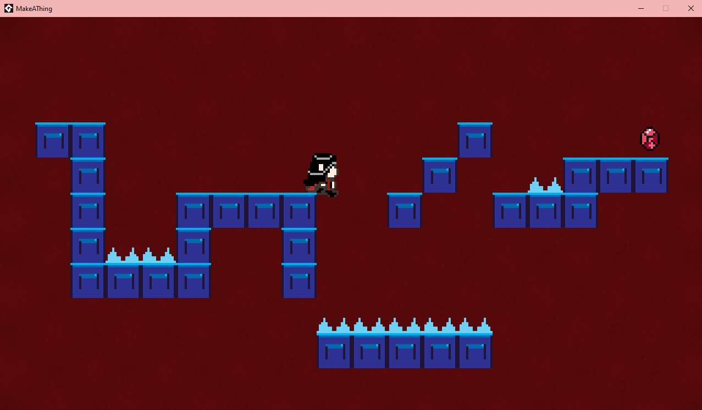
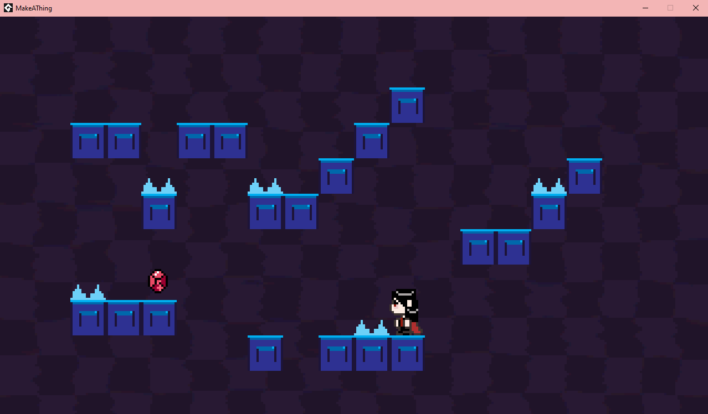
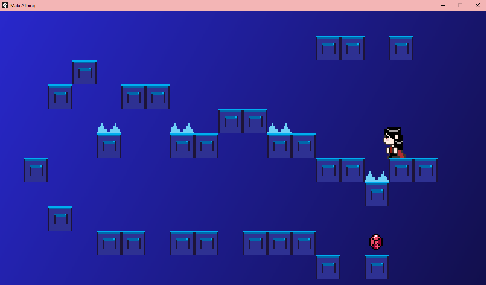
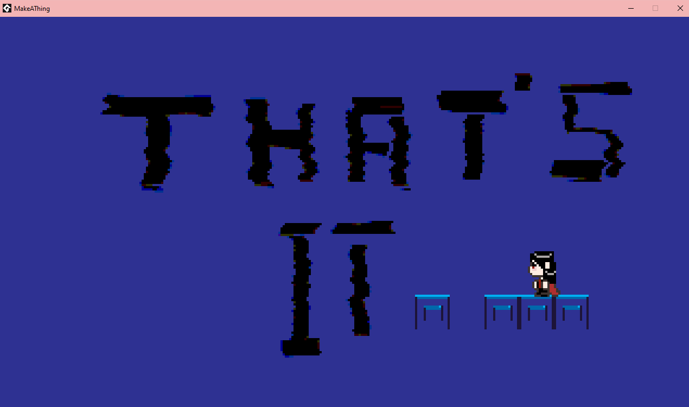
# Journal 02 January 29th 2025
## Getting Started... sort of.
After the first class, I was excited to get to exploring in Unity. Although I have not tried Unity before, it seemed quite similar in some ways to softwares like Maya and Unreal Engine, which I am relatively familiar with. I was looking forward to experimenting. However, I also decided to finally commit to getting myself a laptop, something that I haven't owned during my studies until now (shocking!). I then made the decision that I woud begin working on the Unity explorations once I got the new device, which unfortunately didn't end up being until monday. 
Then came trying to get Unity onto my laptop. for some reason, I had quite a few difficulties. Luckily, I did get it to download, and everything works well, but I sadly didn't get the chance to do the explorations.
Needless to say, this week was definetly more dedicated to getting myself set up for the new semester. It also didn't help that last class was cut short due to unexpected changes in Unity 6, which resulted in complications in the lesson.Well! Better luck next week.
## But... brainstorming for future projects!
Although this week was mostly dedicated to trying to set myself up for the coming semester, I did find myself thinking about where to go in terms of project direction moving forward in the class. My main interest being the possibility of continuing a story-based game that I, working with Olivia Axiuk, created a very short demo for in another class.
The game we imagined, called "Think" is a story-based visual-novel type of game that incorporates puzzle elements, item collection, and environment exploration to advance a branching storyline that the player can explore. The player plays through the eyes of a young woman in her early College years, and delves into the concequences that mental health disorders, isolation and trauma can have on both the individual suffering and those around them.
Of course, the demo is an extremel bare-bones version of the original idea, but I am still very much inspired by it and wish to continue developing on it in hopes of seeing it completed with all the previously imagined functionalities. Although the project was originally done in JavaScript, I think using a game engine will really help with it's development.
The tiny demo can be played here: https://olivax28.github.io/CART263//Projects/Think_FInal/
That's all for now!
# Prototype Journal 03 – Exploring Unity and Drafting Ideas to Further “Think”
## Getting Things in Order and Exploring Unity
Continuing from last week, I made it my goal to explore unity, familiarize myself with the engine, and explore possibilities to further “Think” as a project. Mostly, I want to begin drafting ideas, sketches and concepts to flesh out the following aspects:
- How items will be collected and affect the story
- The menu screens + levels
- What puzzles and other challenges will look like in the game.
In order to do this, I would like to create a list of the things I need to figure out. Originally, the tiny game demo was made in Javascript, so not only will I need to figure out the functionality of the aforementioned new sections, I also need to re-write the code for what already exists, as the basic structure will most likely remain the same. Furthermore, I am not sure whether or not I actually want to even use Unity, as I also have my eye on GameMaker.
This is the current list of all the things I need to figure out:
- FIRST: Re-impliment what I already have in Javascript into the game engine of my choice 
- Narrative development
- Item collection — create an inventory system
- Map + level selection
- Save System
- More in-depth character interaction
- Room exploration – look around the rooms and explore more
- Originally, the game was supposed to have a ‘journal’ that the main character would occasionally write in to develop the narrative. I would like to include this too. Could this double as level/chapter select?
- More in-depth “emotions” from the character that affect the story
I’m expecting this list to change as I continue, but I hope I can get to including these elements since I wasn’t able to originally!
## Exploring Unity
Also this week, I have tried to take this chance to explore Unity more. Although I’m not sure that I’m going to use it for my final project, I still wanted to know more about it. To do this, I followed this tutorial https://www.youtube.com/watch?v=xx1oKVTU_gM

Most of the tutorial worked, which was nice as I wasn’t able to get anything made last week. However, I did want to find another tutorial that maybe used a more recent version of unity, since I kept running into issues regarding the version of my editor that made parts of this tutorial difficult. At the same time, I want to also explore GameMaker moving forward since I was quite happy using it for the first project!

Potential Tutorials I plan to follow to continue my game exploration, with a focus on the dialogue system:
Unity:
Branching dialogue and dialogue systems in Unity with character emotes: https://www.youtube.com/watch?v=1198z5dDc8g
Potentially interesting tutorial - Graph nodes https://www.youtube.com/watch?v=Spa8au6cOmo
Great tutorial to learn Unity basics: https://www.youtube.com/watch?v=AmGSEH7QcDg&list=PLzDRvYVwl53vxdAPq8OznBAdjf0eeiipT&index=2

GameMaker:
Create a Simple Menu System: https://www.youtube.com/watch?v=B4LdYrjHSMU
Interesting tutorial and tools on branching dialogue https://www.youtube.com/watch?v=r_hqY-7rT0c
This is another dialogue system tutorial, which is constructed in a similar way to the original JS: https://www.youtube.com/watch?v=k3AAxKOl-yU Although the tutorial isn’t the best, I can get an idea of an alternative way to set up dialogue.

## Finally…prototyping
I finally got to sketching out some ideas for “Think”, just to get me thinking about what sort of functionality I’ll be needing to implement going forward. These are just very fast sketches to give myself an iea of what assets and what sort of code I have to start thinking about!
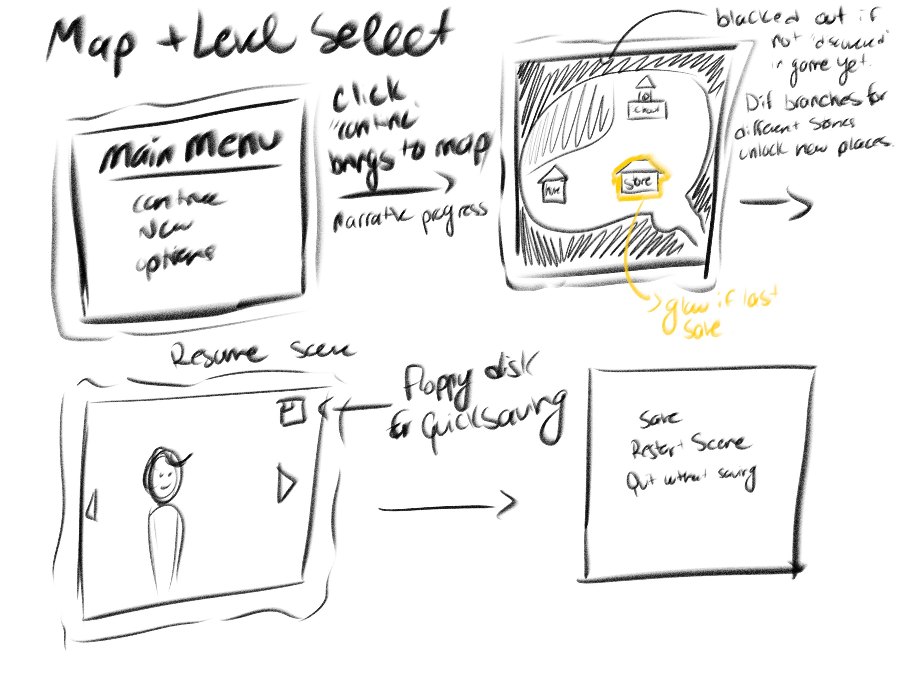
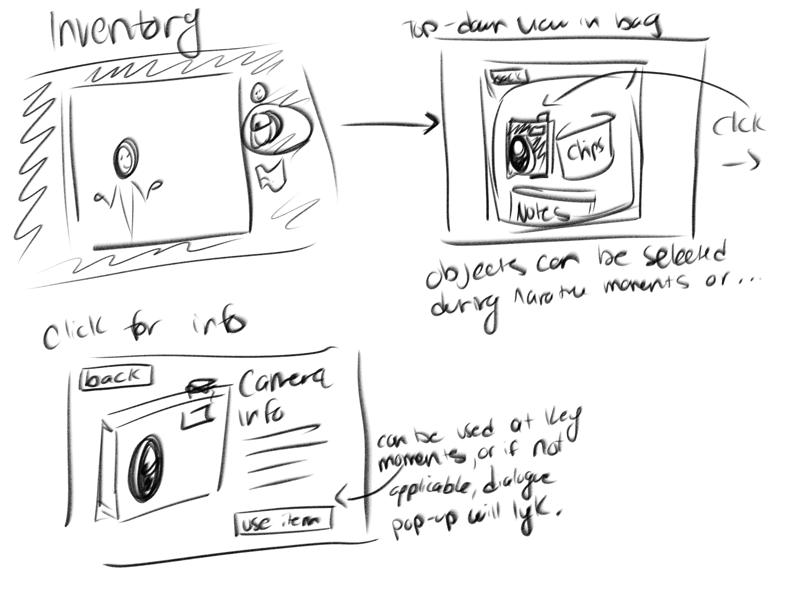
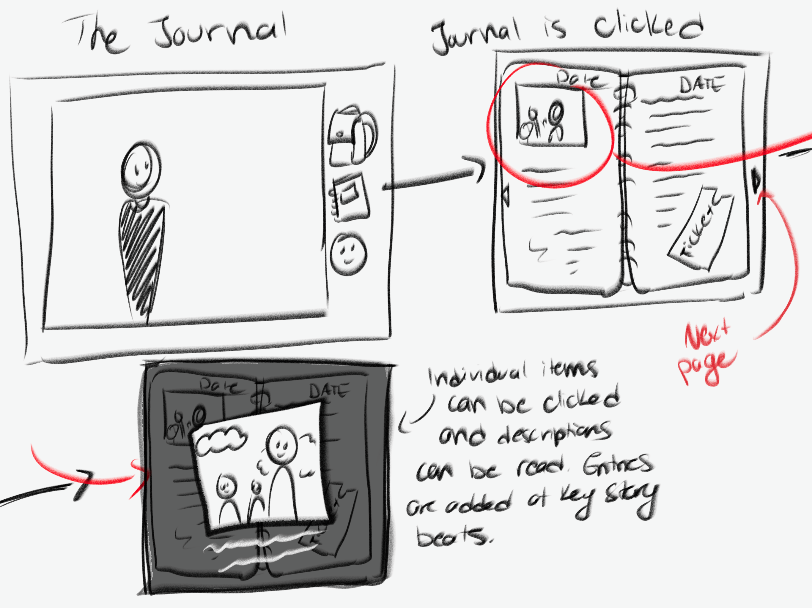

## For next week:
experiment with the GameMaker branching dialogue tutorials and try to get some sort of a scene working.
Begin the Unity “CodeMonkey” tutorial 

# Prototype Journal 04 - Exploring more resources and Learning menus + UI
## Following a Menu Tutorial
After some consideration, I decided that I would most likely do my final assignment in GameMaker, but up until then, I would try to find different ways to integrate similar functions in Unity. 
I decided to follow this menu tutorial https://www.youtube.com/watch?v=liba3xGI4gM
,which was very simple and straightforward, but it took me some time to get through. Unfortunately, I was not able to get it to work, but I hope to look over my issues in class this week and try to see what isn’t working. I hope that once I get this working in GameMaker, I can also continue onto the inventory tutorial that follows after this one, to continue my research into implementing these systems in Unity.

This tutorial took me through the steps of creating a simple UI interface, importing a custom font + assets, creating tabs and working with simple code to bring the pages and tab into arrays that could be triggered on a mouse click. As was mentioned before, I was sadly unable to get the code to work, even after consulting friends who are pretty good in unity! 

## Stepping it up moving forwards
Due to my busy schedule this past week, I was unable to do as much as I wanted to, leaving me to only watch the videos on the GameMaker dialogue systems without actually getting the time to try it out myself. However, I hope to increase my productivity in the next week and continue with the UI development.

## Goals for next week…
With midterms rolling in, I realize it might be difficult to get a lot of work in, but I hope to do the following:
Continue the UI tutorial series into making the inventory system:
https://www.youtube.com/watch?v=wlBJ0yZOYfM
Do more research on branching dialogue system and try it out for myself, whether that be in GameMaker or Unity.
# Prototype Journal 05 - Experimenting with branching dialogue systems.
## Leaving off from last week
One of the areas I wanted to continue exploring was the creation of an inventory system, building off of the UI tutorial from last week. Unfortunately, moving forward in the weel, I found myself caught up in finishing a few larger projects for midterms. With this in mind, and the fact that I was still unable to get last week’s tutorial to work, I decided it would be more interesting to go onto something completely different, and something possibly even more fundamental to any game that I would want to make – dialogue.

## Research on dialogue options
The more I delved into the options for creating dialogue in unity, the more I realized how many options there were. I decided to go with this one:
https://www.youtube.com/watch?v=Spa8au6cOmo&t=118s. This tutorial teaches you how to use the new ‘graph toolkit’ to build a dialogue system in Unity. Unfortunately, I was having some issues getting it to work, so I decided to switch gears for this week.

## Switching Gears – delving into 3D open world exploration
Feeling slightly discouraged after two weeks of non-working tutorials, I decided I wanted to do something that would yield a physical outcome, which is why I decided to experiment a little with open-world exploration and premade assets. Following this tutorial https://www.youtube.com/watch?v=WbZpj8WcjN0

I found that doing this tutorial,because it was fun, easy and yielded a very tangible result, made me feel more encouraged to pursue my projects moving forward. Using the premade assets sped up the process very quickly, and although I would rather make my own environment assets, I can see myself using pre-made pieces moving forward on things like player mechanics, cameras and other very common but tedious necessities for a game prototype.

The end results was a fully-explorable 3D world, and I was able to delve into the 3D tools that I hadn’t explored before.

The 3D world made from the tutorial was the one presented below: a first-person 3D world populated by trees with colliders, animated grass, rocks and flowers.

# Variation Journal 01
## Considering Ideas
Originally, I came into the class with the idea that I would build on one of my previous projects, with this previous project being “Think”; a choice-based game where the player is tasked with helping the main character navigate through her life, ultimately deciding whether or not she is able to overcome her mental illness. Although this project is very important to me, I did come up with some other ideas during our last class. One of these ideas was what I playfully called an “evil pet-care” simulator. It would be based on games such as ‘Nintendogs’ which have the player adopt and take care of an animal. However, mine would feature the player working in a lab taking care of hybrid creatures, while also having to aid in the experimentation on these creatures. My goal for this game would be to communicate themes surrounding animal testing and the ethical concerns regarding people’s tendencies to only help ‘cute’ creatures versus disregarding ‘ugly’ ones in animal rescue + conservation.

## Gameplay and Brainstorming
If I am to continue with my new idea, I would be basing myself partly on the aforementioned “Nintendogs” game for its gameplay as well, playing on the nostalgic aspect to juxtapose the uncomfortable themes. 
“Nintendogs” operates mainly through a ‘main menu’ that allows the player to choose from different activities in order to care for the pet. 
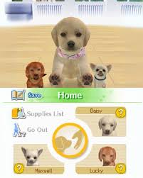
While I envision my game to have a narrative aspect to it as well, the player would be navigated back to this menu after receiving narrative pieces in order to continue taking care of/managing the creature.
Once chosen, the player would then be brought to a new screen where they would be prompted to play a minigame based on whatever option was chosen. In “Nintendogs” these options would be things such as walking the dog, feeding it etc. whereas in my game there would be different options for the creature, such as bringing it to the lab, as well as more traditional options like feeding it, cleaning its cage etc.
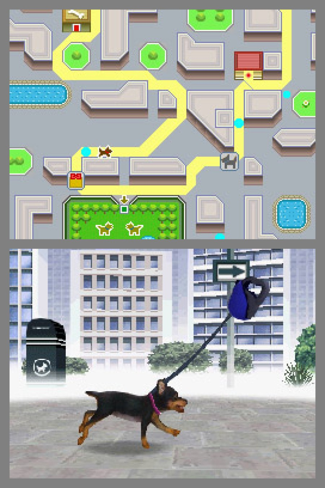
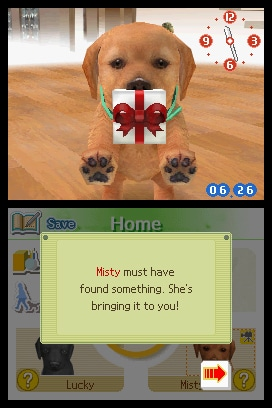

The player would, in theory, be prompted to do things that are more and more uncomfortable, before they must make a choice to continue, or risk ‘losing’ the game in order to save the creature under their supervision. The menu options would also be changed after visual-novel style ‘cutscenes’ that would progress the story between regular gameplay.

## Developing
If I were to proceed with the pet-care idea, I would be making a detailed ‘vertical slice’ of the game, as a full version of something like this would take far longer to make! Also, another key difference: I would not be implementing the 3D, and would instead be illustrating the visuals for the game 

As for design values, I think they are relatively similar for both ideas that I want to potentially continue with in the class. I aim to prioritize creativity, narrative and clarity in order to create an interesting and fun experience for the player. After all, the main way to make a theme make an impact is if the player has fun getting to the message at the end of the game!

## Work for this week
As for what I physically accomplished this week, I finally got to trying out a branching narrative system in GameMaker! And to be honest, I think this one is the best I’ve come across, as it allows for a lot of flexibility in the narrative writing. Moreover, I can use this same system for both games that I want to make, since they both have a branching-narrative aspect to them. 

The system I created using this https://www.youtube.com/watch?v=r_hqY-7rT0c&t=259s
tutorial and the creator’s assets, implements the “Chatterbox” plugin for GM and the “Crochet” app to work.

Chatterbox: https://www.jujuadams.com/Chatterbox/#/3.2/
Crochet: https://github.com/FaultyFunctions/Crochet

In crochet, there is minimal coding, and is basically a ‘tree’ visualisation of the dialogue and options that will be later implemented in GM.

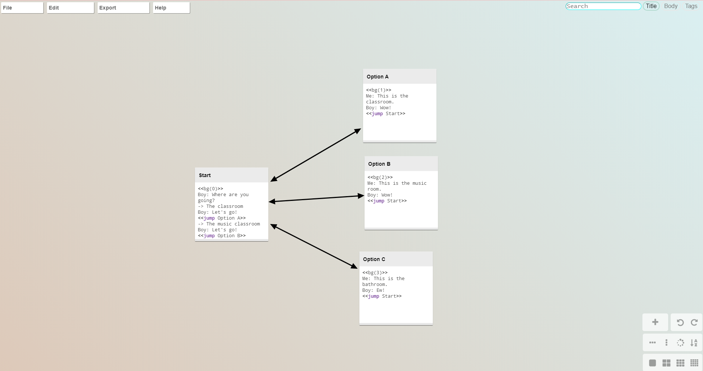

Once in GM, Chatterbox can be used to parse the information into something understood by GM, and can be dynamically added on and changed by going back into Crochet’s “yarn” file as shown above.

This was the final result of the tutorial, an interactive system with character sprites that become bigger/larger when speaking, changing backgrounds and clickable options.

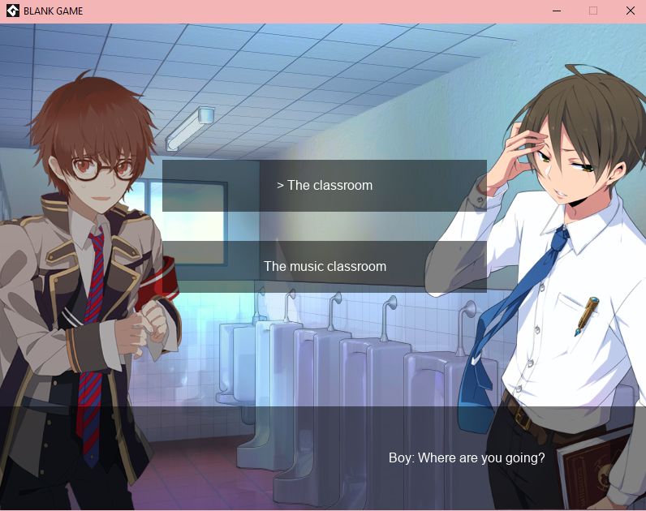
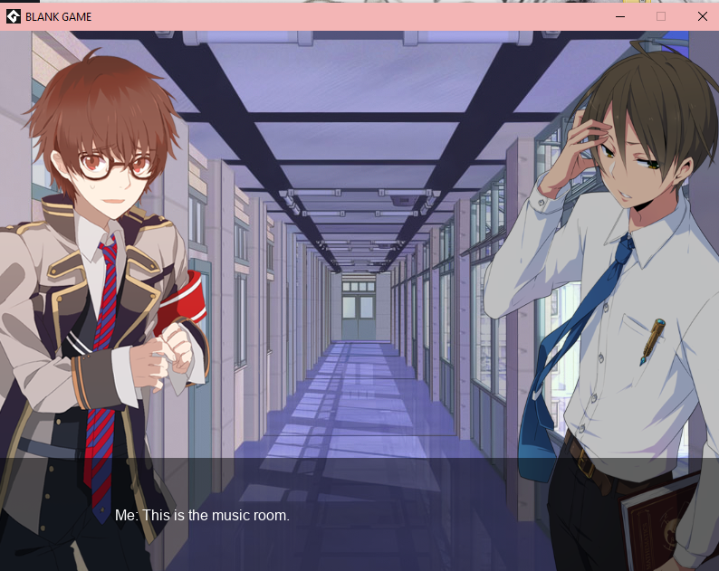
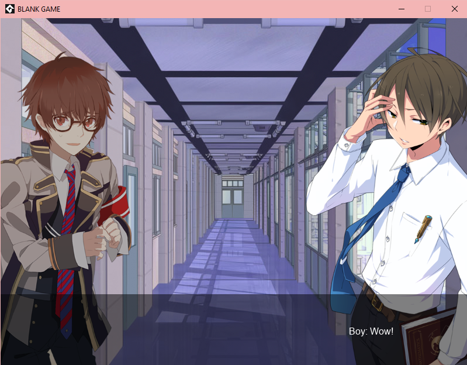

Because I will not be using the assets and will be modifying the system, I will call this a partial implementation prototype to test out this feature that I will implement into the larger scope of whichever game I go forward with.

## For next week
Next week I will of course settle on one of my two ideas, but I also want to begin creating a system that is more customized, and with place-holder assets begin the story-portion of my game.

# Variation Journal 02 2026-03-12

## Finally Settling on a Project
Before last week, I was quite torn between the two ideas that I previously had. One option, and the idea I had coming into the class, was to work on finishing/polishing the game “Think”. However, I was torn between this and going forward with making a vertical slice for a new concept. 
Funnily enough, I went with neither. In fact, after some discussion, I decided to team up with Olivia Axiuk for the final project, working together to hopefully create something far more polished than either of us could have done on our own. 
There were a few factors that led me to make this decision. Firstly, I just genuinely felt excited about her idea; a sort of cozy mystery game where you play as an electronics shop owner, navigating unfamiliar digital spaces in order to complete tasks and satisfy your customers, with a few spooky twists.
Secondly, as the semester progressed, we both began to feel the pressure of the upcoming finals. Knowing that we work well together, we decided that teaming up would alleviate some of the pressure and allow us to not only to hopefully make a better final product, but to also actually enjoy the creation process.
Lastly was simply a software compatibility issue. My original ideas were to be done in GameMaker, using Crochet and Chatterbox to implement a branching narrative. Although I am still very interested in pursuing these avenues in the future, I found out that gameMaker is no longer made to be compatible with Macbooks. This would heavily hinder my ability to work in class, and so I decided to turn my attention to a project done fully in Unity.

## Concept Design
To begin, we decided it would be best to get a firm grasp of the visuals of the game in order to better direct our decisions going forward. I began sketching some character designs, environment sketches and floorplan layouts for the electronics shop that the game would take place in. 
Originally, the game was supposed to be far more ‘horror’ leaning, but as we discussed together, we finally decided to go with something far more ‘creepy-cute’. We mixed together a simplistic, nostalgic style with unexpected eerie elements that the player would find while trying to complete their tasks. However, we definitely ended up putting much more of an emphasis on the ‘cute’!
Here are a couple of full concept sketches, featuring one of the customers and overall ‘feel’.

## Functionality Implementation
The game has two main ‘modes’ that the player can interact in. Firstly, we wanted the player to be able to walk around the shop in a 3D space. As the game progresses, the player will have to talk to the clients of their store and fetch items hidden around the room. Luckily, Olivia had already begun to explore how to implement an interaction system, and have a bubble pop up with text when an item or character is interacted with.
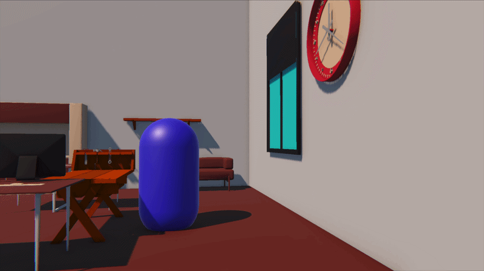

This was an excellent place to start, and is also in itself a necessary interaction in our game.
Off of this, we began to design the more menu/UI portion of the game. The idea was that, with every customer that comes in, the player will have to fix software issues on their devices, and would therefore need to navigate through the files. With on-screen prompts, they will be guided to complete the tasks. These sketches were done by Olivia.

With this in mind, we used the original interaction system, and built a new function that, when intercting with the computer in the room, makes the menu pop up. The menu is made with Unity’s buttons, and uses on-click functions to both hide and make the various menus appear.

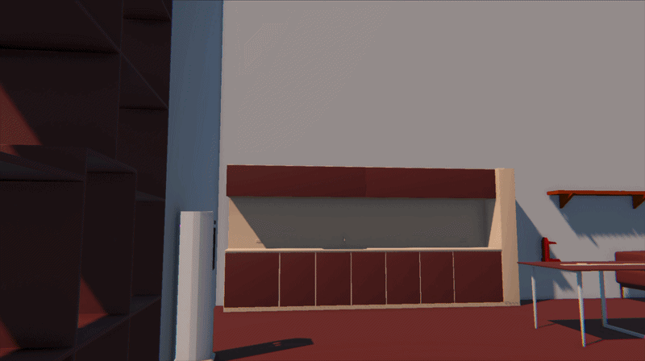

The final task I completed for this week was a simple 3D model for our first customer, who is featured in the sketches. We wanted to bring a sense of nostalgia to the game. Especially since our aim is to play with retro-aesthetics, we knew the visuals wanted to coincide. Therefore, we decided to keep the models very low-poly, and will instead implement most of the details with the textures (yet to be seen).

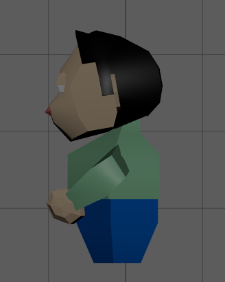
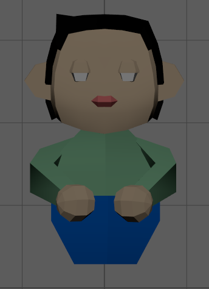

## Tasks Completed, and Tasks to be Done
I feel quite confident with our progress so far. Already, we have the base for most of the functionality of the game. The next biggest thing is to implement a task system that will automatically update as the player completes the task, and that triggers a new customer to come in when completed. Theoretically, these customers and their associated functions, models and such will be in an array that will move forward when the “final” task on the previous customer is completed.

## For Next Week
For next week, I want to finish figuring out the base functionality. Meaning, I would like to at least get a very basic task system working with Olivia. I would also like to get more of the 3D models done for the store environment. If possible, i would also like to get one 'item' working, meaning an interactable object in the store that the player can use to complete one of the aforementioned tasks.

# Variation Journal 03 2026-03-17
## Last week’s goals
As of last week, my sister and I were set on scoping out the story, creating more assets to get a stronger grip of the visuals for our little game, and finding a way to implement a task/quest system. I worked on the quest system, while also helping out with the story. Out of our goals, we got most of this done. We have a much better idea for the narrative, and we have more 3D models and visuals. However, as far as the task system, this ended up being quite a bit more complicated than I initially thought. Overall, though, I’d say our progress is pretty decent.

## Visuals
As far as visuals, we finally have a main character model, and Olivia did some work on the lighting in order to give more ambiance to the scene inside the shop. We also have a proper little 90s PC to interact with.

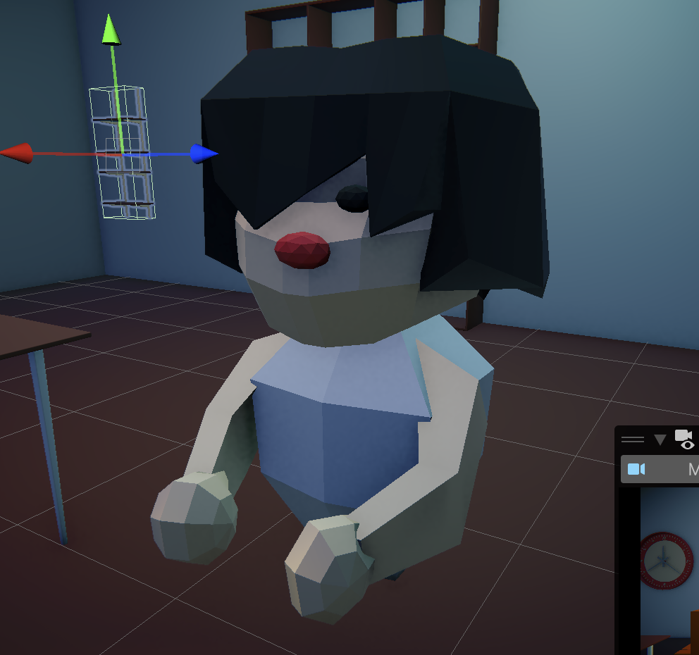
*Main Character Sculpt. Although not seen directly, their face will show in mirrors. And it’s fun to be able to see your body as the player when looking down.*
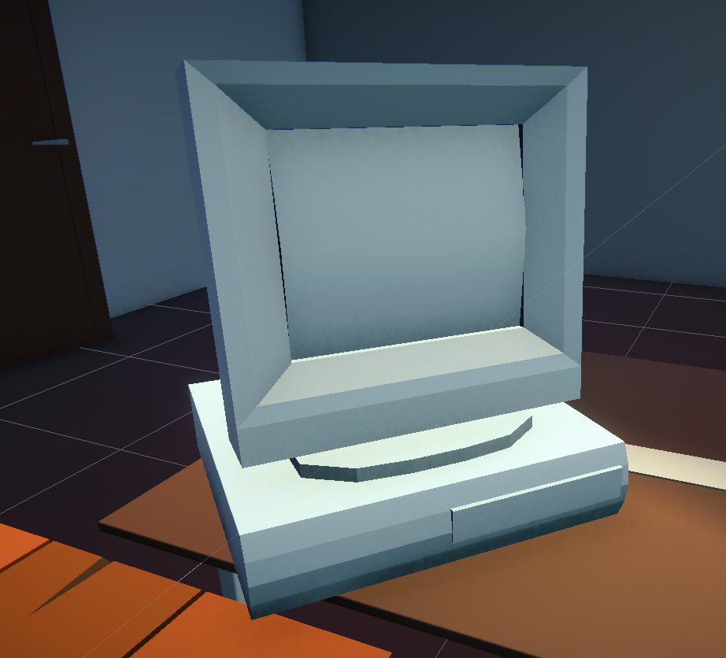
*A proper little computer*
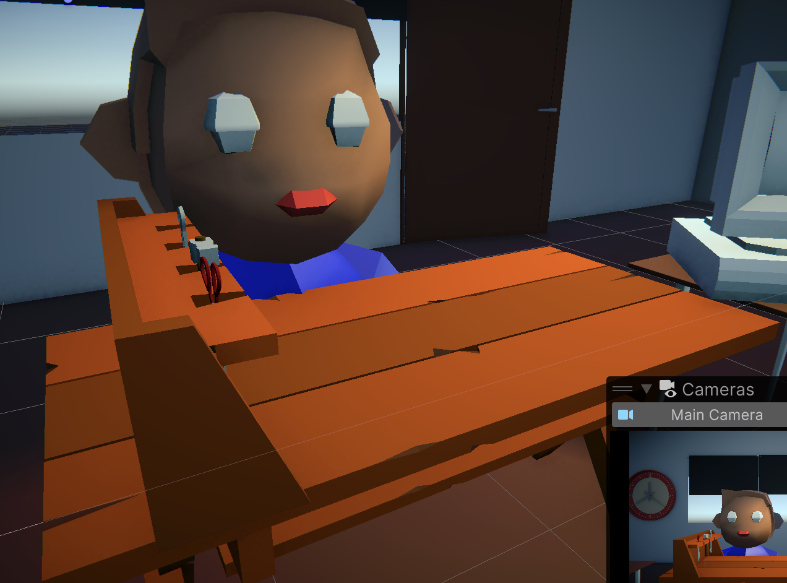
*Slightly more mysterious lighting*

Moreover, Olivia went the extra mile and edited the computer homepage/menu, which now allows for the windows to be dragged around the screen for a more interactive experience.

This small change, when I tried it out, really made quite the difference in having the interaction feel more convincing. Moreover, we plan to integrate the ability to bring each window forward with a click, further adding to the realistic feel of interacting with the computer.

## Functionality Integration
As for coding, I began trying to find a way to have a well-structured quest system that would allow for collecting objects, completing tasks and having said tasks ‘unlock’ other areas of the game/other quests.

Because I do not have much experience coding in C#, I knew I wanted to follow a tutorial in order to get myself started. I found “Shaped By Rain Studio’s” tutorial on Youtube (link here: https://www.youtube.com/watch?v=UyTJLDGcT64&t=2093s), which covers all of this and more. 

The tutorial took me through the steps of having multiple manager systems, an interactable quest object and much more.

Unfortunately, due to the length of the tutorial and its surprising complexity, I was only able to make it to minute 34 if 60. I hope to continue the tutorial and get this system done so that I can modify pieces of the code for our game.

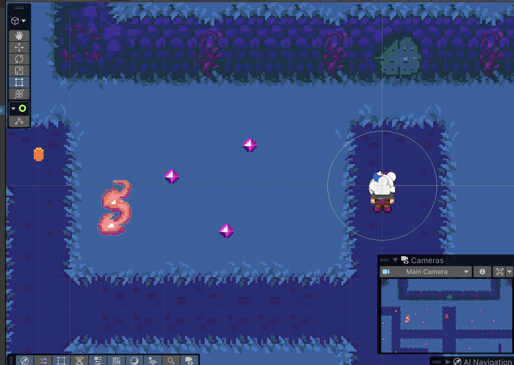
*Default Assets given by the tutorial, with the little orange squiggle being my wonderful quest object.*
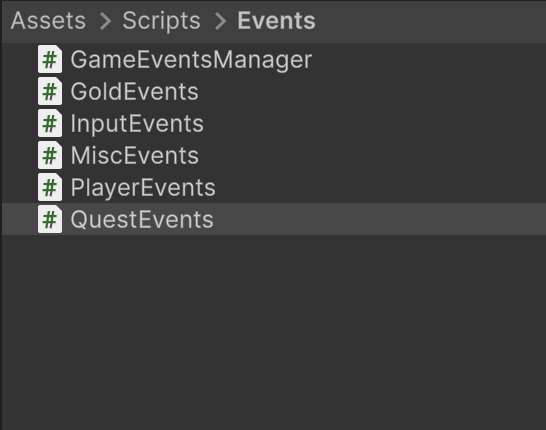
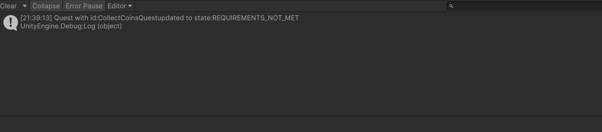
*The console is reading my code! Hurrah!*
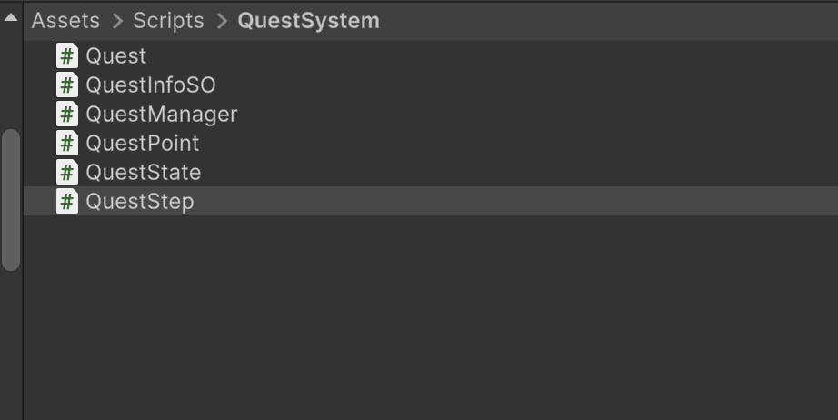

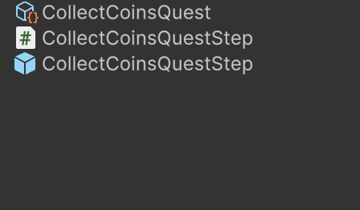

Moreover, I also seem to not be able to get the quest object to interact when I press ‘enter’ on my keyboard, but I’m not getting any errors. If I’m not able to resolve this, I will continue to watch the tutorial but will instead download the finished code, and have a look at it that way.

## Next Week Goals
### Next week
- Continue furthering the narrative
- Get a form of the quest system in the game
- Continue working on the visuals

That’s it for now !!

# Variation Journal 04
OOPS running a little late on this one…
## What I was working on…
Why was I late? Well, I’ve been desperately trying multiple ways to implement a quest system into the game.
At first, I was following a complex tutorial (mentioned last week) that implemented a multi-facetted system that used a questSO, multiple prefabs and so on in order to create an extremely robust system that allowed for easy modular editing. Considering that I would like to continue working on this project past the ‘vertical slice’ that Olivia and I are aiming to have finished by the end of this project, I knew I wanted code that would be easily editable. 

I was extremely determined to understand this system. But alas… even though I am quite certain I could have eventually gotten to wrap my head around all the content in the 1 hour video, I found that I just do not have enough time going forward.

## Takeaways
Luckily, I do not feel as if I totally wasted my time. In fact, following the tutorial and really trying to understand how the system worked got me to be way more familiar with creating a main code as an overarching controller, serializable and non-serialized variables, using prefabs and inputting them into serialized variables and also just the general functioning of C# and Unity. 

Following the original tutorial, I made myself several pages of notes, as follows.

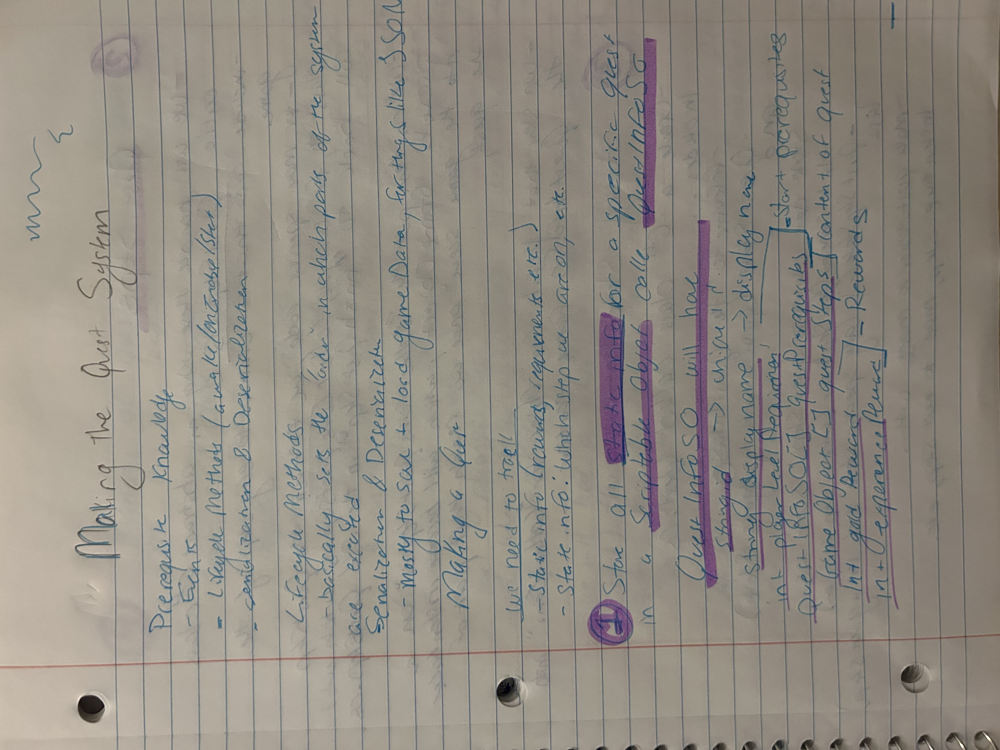
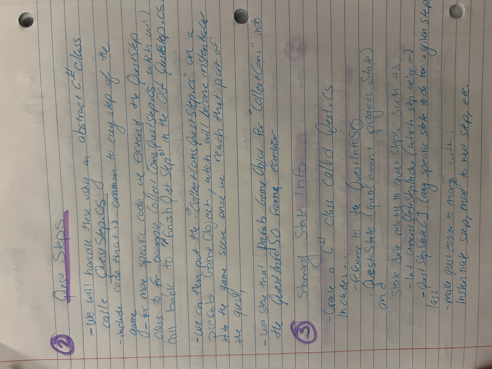
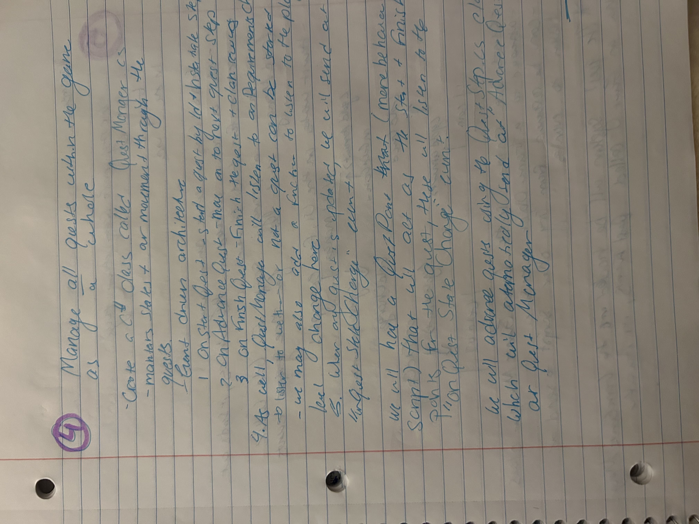
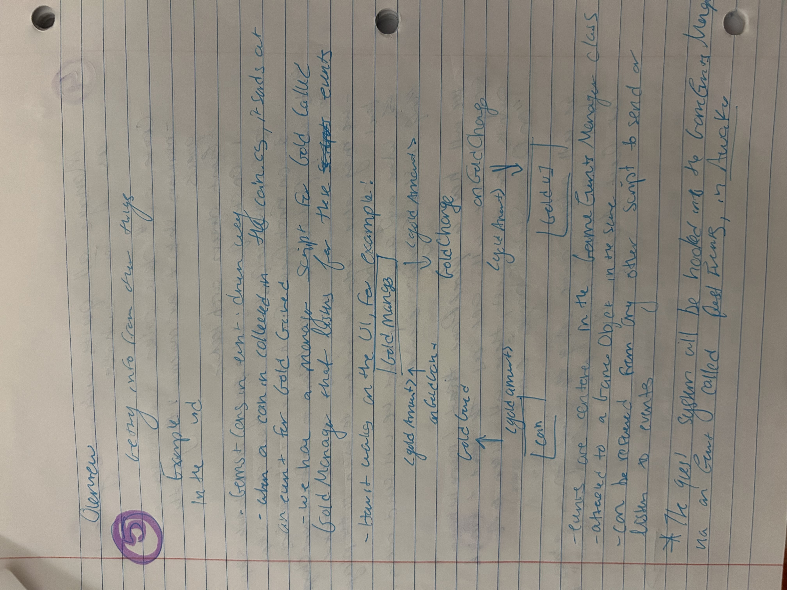
*I was determined to understand this, clearly*

Like I mentioned, while I did not continue with the original tutorial by “Shaped by Rain Studios”, it did help me wrap my mind around certain complex topics that I was unsure of originally.

## The New Quest System…
Of course, our game still needed a quest system, and luckily I was able to find a similar yet much more streamlined version of By Rain’s task system created by none other than the lovely “Game Code Library” on YouTube. Hers, while similar, is a much simpler system that also allows for a dynamically changing UI element that I thought would fit perfectly for our project.

Following her tutorial, I managed to create several new functionalities for our game. 

First, I created a simple script that allows for the dynamic addition of new items that can later be stored into an inventory (yet to be implemented). This script allows for collectible items to have a number ID assigned to them. This number allows them to be assigned to a specific quest. This specific one refers to the floppy disc, or ‘disc’.
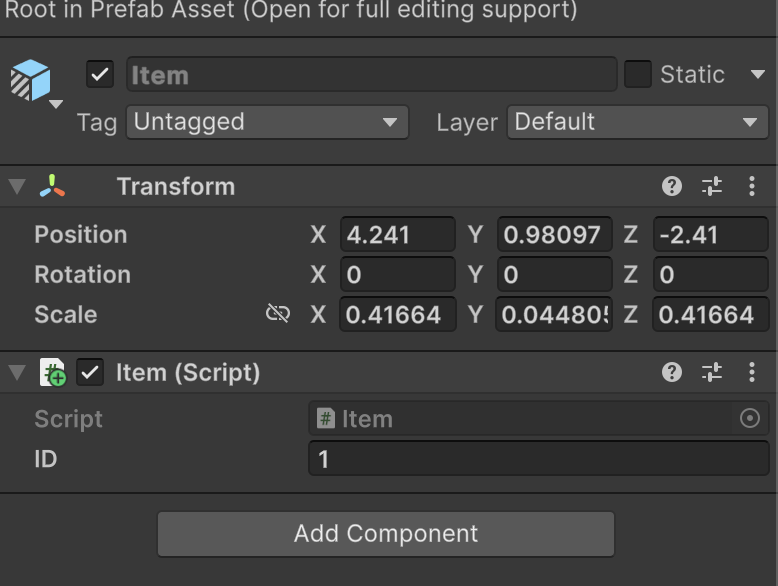

Next, I also created a simple “quest script”, which will be made more complex later, but for now the script allows for this quest to have a number ID which matches the associated quest item. It also allows for me to input separate quest descriptions, number of items to gather etc. for each individual quest, which can be made into individual scriptable objects. Moreover, I can choose which ‘type’ of quest each SO is once they're created from a list.
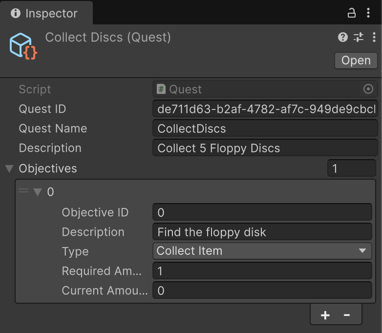
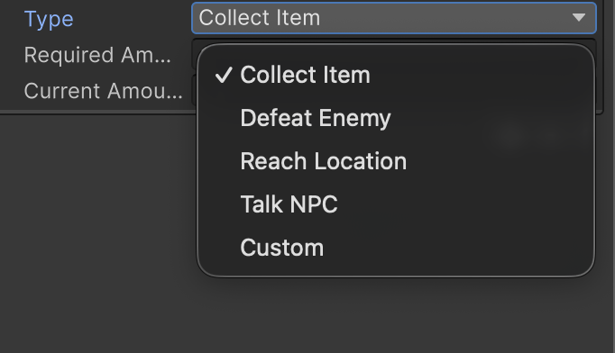

Awesome!

Finally, I also have the quests hooked up to a dynamically changing UI. This is done through a script that allows for the UI text elements to be replaced dynamically with the text associated with the description of each quest. When a quest is added, the title, description and number of items associated with the received quests will appear here. This is controlled by another script that keeps track of what information goes where, called the ‘QuestUIController’. For now, as I am missing some quest functionality, you can see it in action through the repetition of the same quest over and over.
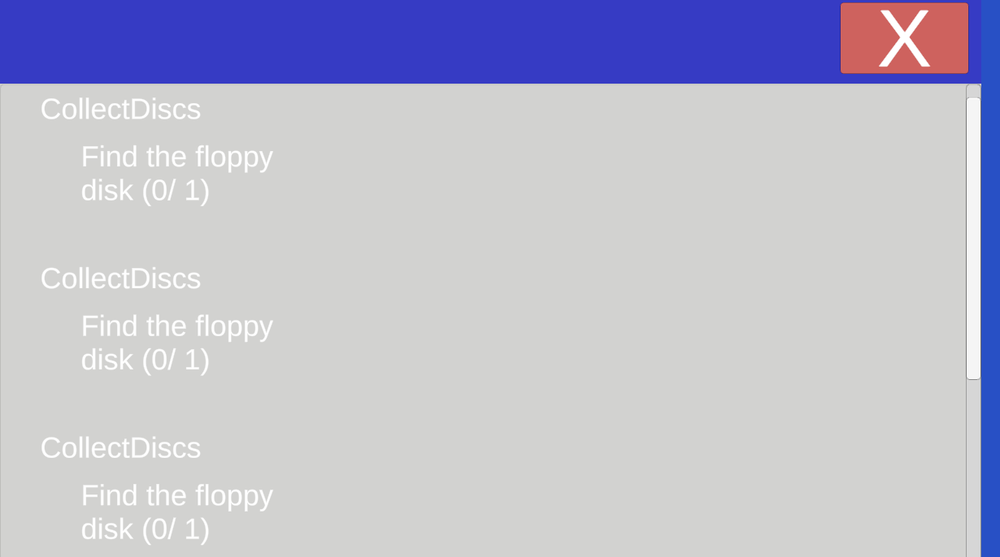
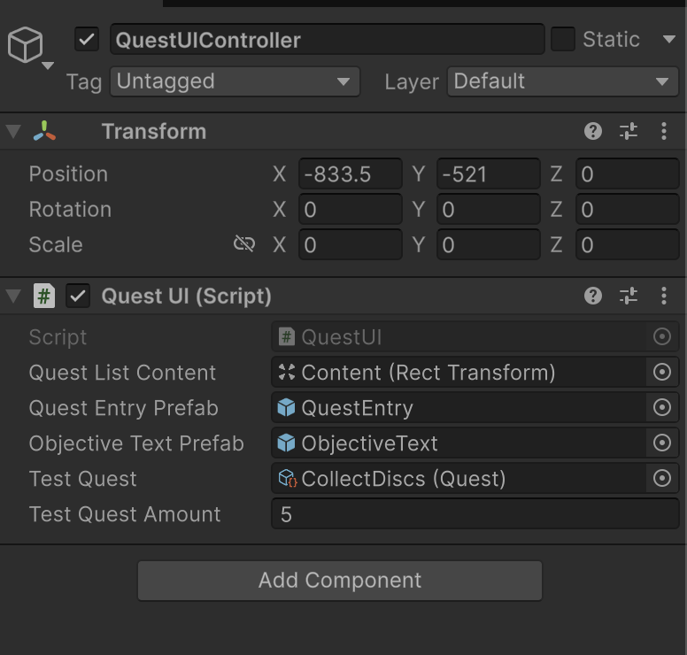

## On My Teammate’s End…
On the other end, Olivia worked on several aspects of the game as well. First and foremost, she finally got the interaction system finalized and working nicely, with visuals that tell the viewer what they’re interacting with. When trying it out, I found even just this small change made the game feel much more polished, and gave it that little extra detail that made playing it feel seamless.

More on UI, she also added in a scrollable window into the computer UI mode, which gives that extra little bit of realism.

She also worked more on the visuals, adding some 3D models into the game to populate the 3D space, which added a nice touch to the scene and also made the game have that little extra edge to bring it up a notch.
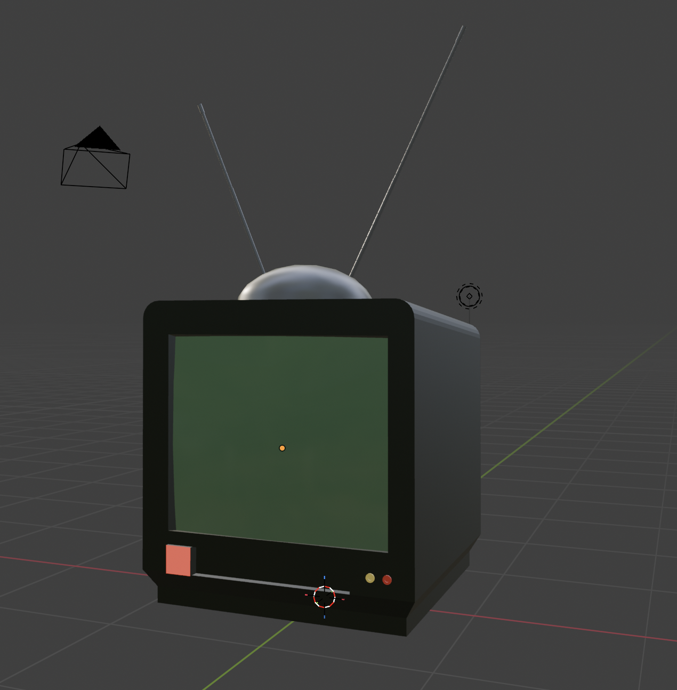

## Reflection and where to go next…
Next tasks to do on my end
Finish the quest system with 
Accept and give items
Finalize the UI
Inventory
Overall
Implement the story elements once full functionality is done
Clean up the visuals
### How exciting!

